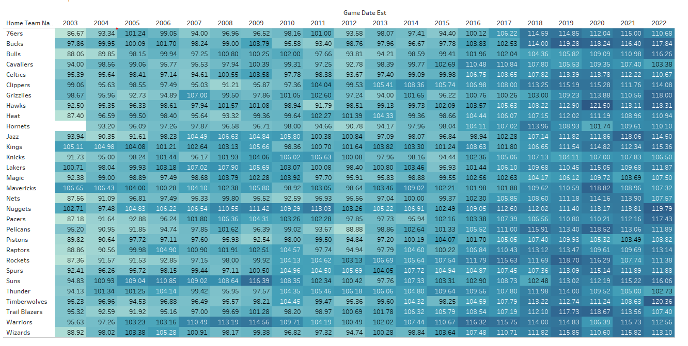
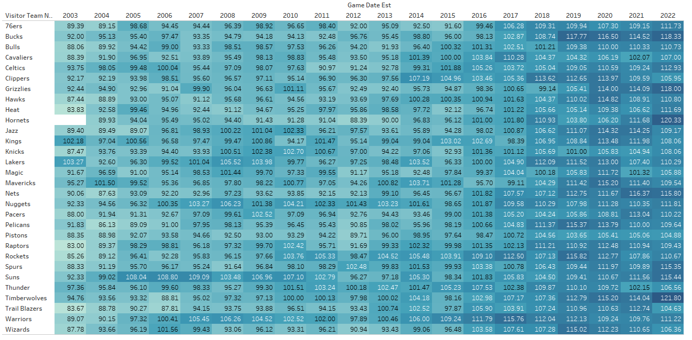
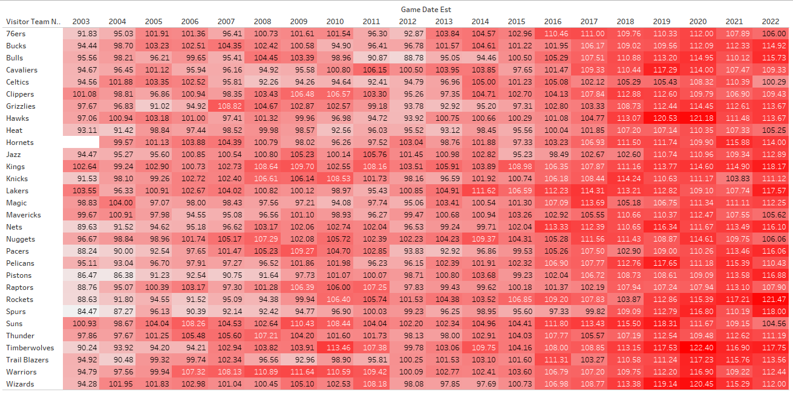
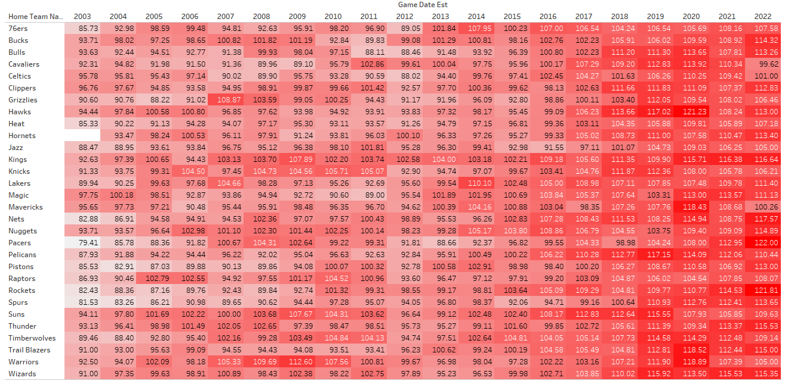

# nba-data
Showcasing some nba data I found interesting. You can see the progression of the game. Scorelines are getting higher, I think players are getting better at shooting threes raising the average points per game.

### AVG Per Season

#### Home Pts

#### Away Pts

#### Pts Lost While Away

#### Pts Lost While Home

